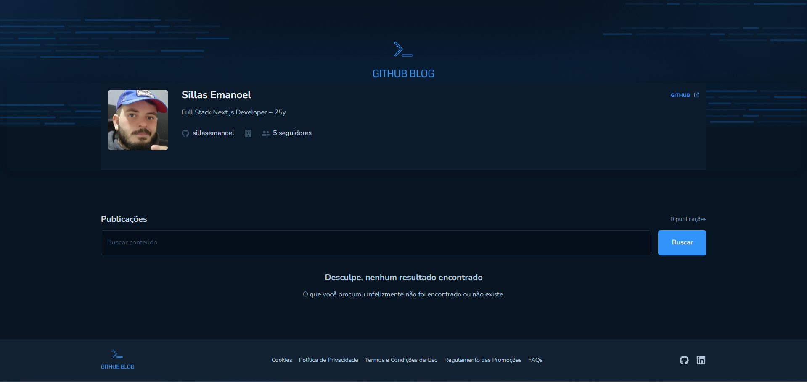

# GitHub Blog (React)



Acompanhe as últimas atualizações de issues do seu portfólio diretamente no Github Blog!

O Github Blog é uma aplicação desenvolvida com React, serverless, que utiliza a API do Github para exibir as issues de um repositório em formato de blog.

## Iniciando o projeto

```bash
# Clonar aplicação
$ git clone https://github.com/sillasemanoel/github-blog.git

# Acessar a aplicação
$ cd github-blog

# Execute npm para instalar as dependências
$ npm install

# Para iniciar a aplicação
$ npm run dev

```

## Ferramentas

- React
- Styled-components
- React Router DOM
- Axios
- React Icons
- React Markdown
- Vite

## Aprendizados importantes

- Conceitos de Estado e Imutabilidade de estado no React
- Listas e chaves no React
- Propriedades e componentização
- Estilização com Styled-components
- Configuração de projetos com Vite
- Manipulação de datas com Date-fns
- Consumo de APIs com Axios
- Navegação com React Router DOM
- Renderização de Markdown com React Markdown

## Funcionalidades

- Visualizar lista de issues
- Visualizar detalhes de uma issue
- Buscar issues